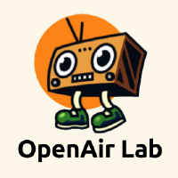
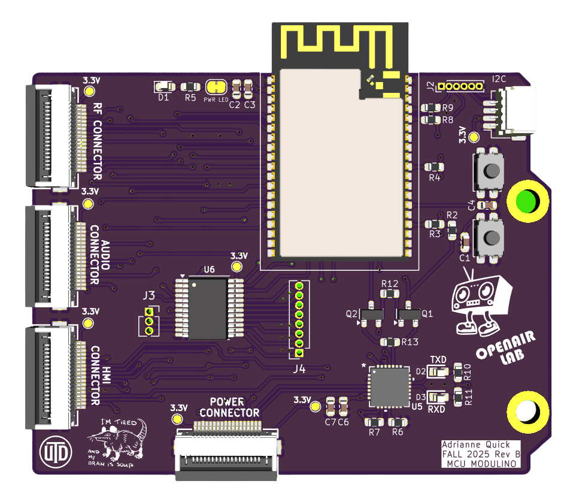
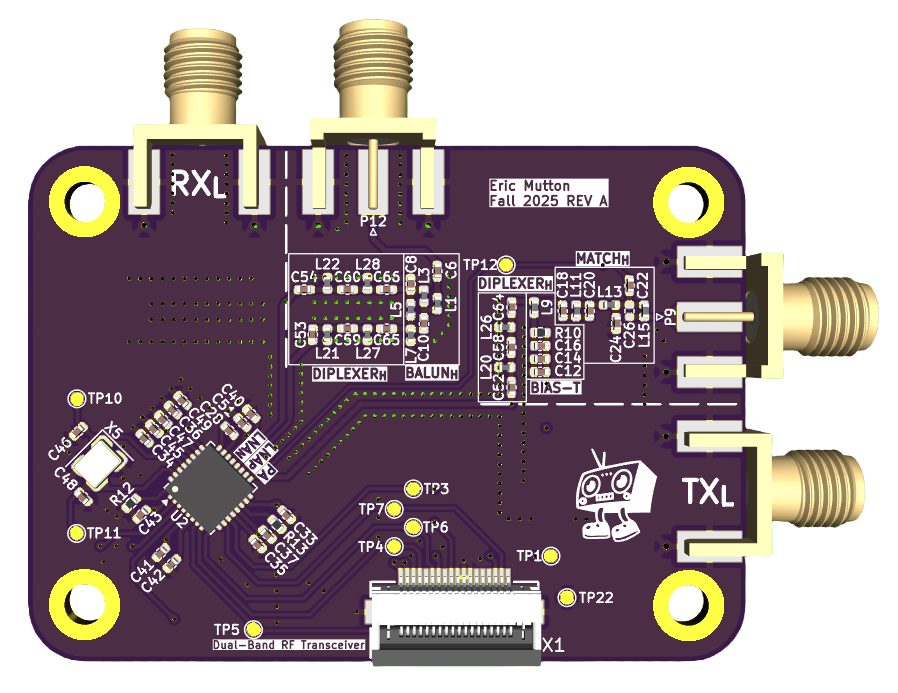
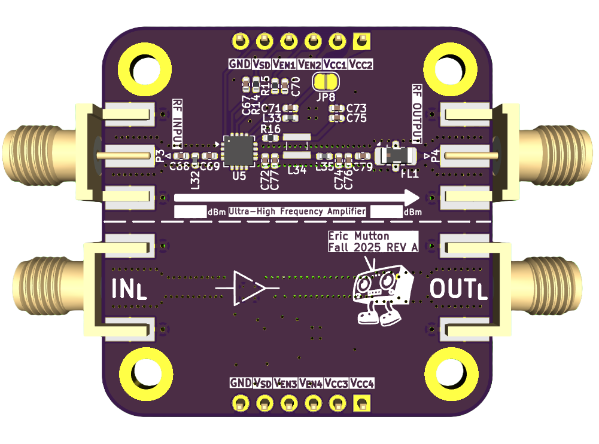
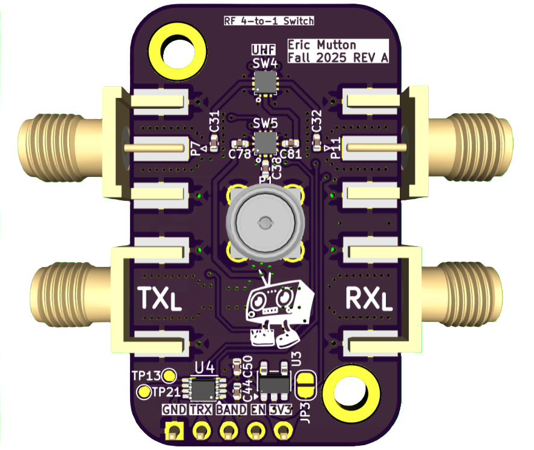
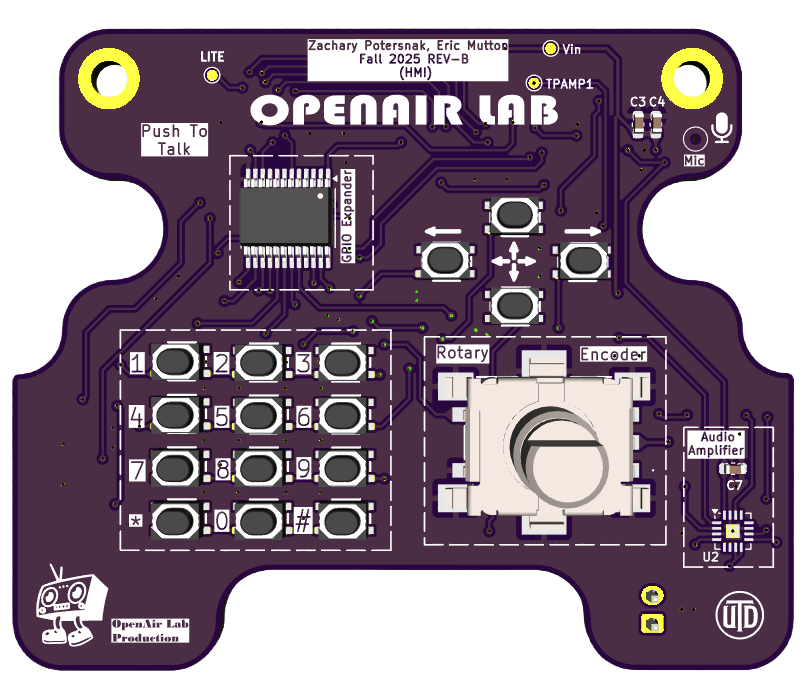
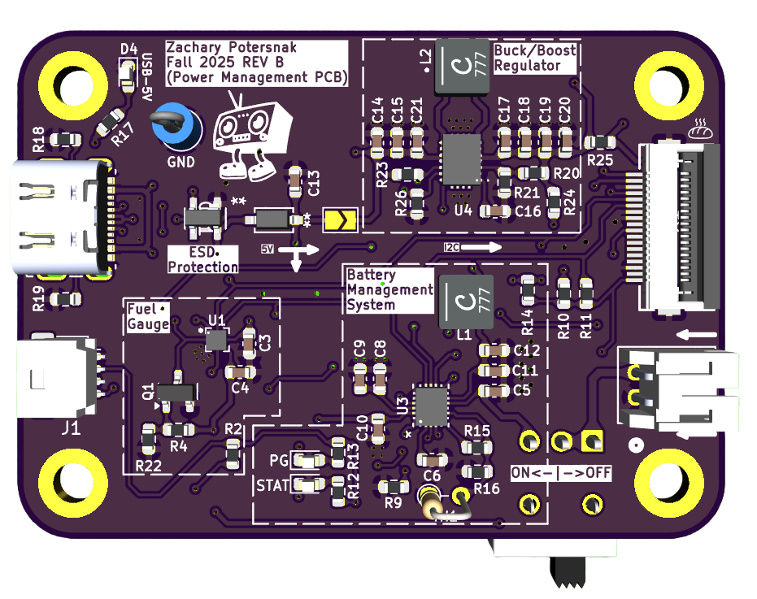

<h1 align="center">
  
</h1>

  OpenAir Lab – Modular Handheld Radio Development Kit  
   
  <a href="#about"><strong>Explore the project »</strong></a>
    
  <a href="https://github.com/OpenAir-Lab/capstone-project/issues/new?labels=bug&template=01_BUG_REPORT.md&title=bug%3A+">Report a Bug</a>
  ·
  <a href="https://github.com/OpenAir-Lab/capstone-project/issues/new?labels=enhancement&template=02_FEATURE_REQUEST.md&title=feat%3A+">Request a Feature</a>
  ·
  <a href="https://github.com/OpenAir-Lab/capstone-project/issues/new?labels=question&template=04_SUPPORT_QUESTION.md&title=support%3A+">Ask a Question</a>

---

## **About**

OpenAir Lab is an **open-source, modular handheld ham-radio development kit** designed to expose and teach all fundamental subsystems of a portable transceiver. Unlike commercial “black-box” radios, this platform separates RF, MCU, audio, power, and HMI into independent **Modulinos** connected through standardized EYESPI and I²C interfaces.

<<<<<<< HEAD
The system’s core is an **ESP32-WROVER-E** MCU hosting RF control, audio streaming, display driving, and power-management logic. 

Subsystems include:

- **RF modulino:** TI CC1200 sub-GHz transceiver  

- **HMI modulino:** 1.9" ST7789 TFT via EYESPI, keypad, user buttons, rotary encoder  

- **Audio modulino:** ICS-43434 digital MEMS microphone + MAX98357A I²S amplifier 

- **Power modulino:** STUSB4500 USB-PD, BQ25622 charger, fuel gauge  

- **Control plane:** I²C expander for low-rate signals (LEDs, keypad, resets, alerts)

=======
The system’s core is an **ESP32-WROVER-E** MCU hosting RF control, audio streaming, display driving, and power-management logic. Subsystems include:

- **RF modulino:** TI CC1200 sub-GHz transceiver  
- **HMI modulino:** 1.9" ST7789 TFT via EYESPI, keypad, user buttons, rotary encoder  
- **Audio modulino:** ICS-43434 digital MEMS microphone + MAX98357A I²S amplifier  
- **Power modulino:** STUSB4500 USB-PD, BQ25622 charger, fuel gauge  
- **Control plane:** I²C expander for low-rate signals (LEDs, keypad, resets, alerts)

>>>>>>> e82c24f (docs: organized REV A and REV B pcb and schematic files and put them into their relavent folders)
Purpose:  
• Provide a hands-on educational platform for embedded, RF, and systems engineering  
• Enable modular experimentation and rapid firmware iteration  
• Deliver a working open-source handheld radio for expo demonstration  

---

### **Built With**

- **ESP32-WROVER-E** (dual-core 240 MHz, Wi-Fi/BT, PSRAM)
- **CC1200 Sub-GHz RF Transceiver**  
- **Adafruit 1.9" ST7789 TFT Display + EYESPI connector**  
- **ICS-43434 MEMS microphone**  
- **MAX98357A I²S amplifier**  
- **STUSB4500 USB-PD controller**  
- **BQ25620 battery management IC**  
- **I²C GPIO Expander (TCA9539/MCP23017)**  
- **FreeRTOS-style firmware architecture** (timers, ISRs, tasks)

---

## **Getting Started**

### **Prerequisites**

The project requires:

- ESP32 toolchain (ESP-IDF or PlatformIO/Arduino)
- EYESPI breakout for the TFT display (18-pin FPC)
- Access to I²C and SPI buses for CC1200, audio, and PD controller  
- 3.3 V power supply capable of ≥500 mA for ESP32-WROVER-E  

### **Installation**

1. Clone the repository  
2. Open the firmware directory in ESP-IDF or PlatformIO  
3. Connect the MCU modulino to UART (use BOOT/EN buttons on custom boards)  
4. Build and flash the firmware  
5. Connect modulinos via EYESPI and I²C cables  

---

## **Usage**

Firmware operates through **interrupt-driven inputs**, **FreeRTOS tasks**, and **timers**:

- Keypad, encoder, and PTT interrupts update application state  
- CC1200 provides frequency control, RX/TX switching, and RSSI sampling  
- TFT displays live frequency, signal strength, battery state, settings  
- Tasks handle display refresh, PTT timeout, and periodic battery polling  
- Audio subsystem processes microphone data and sends I²S audio to amplifier  

---

## **Roadmap**

See open issues:  
https://github.com/OpenAir-Lab/capstone-project/issues

Current priorities:

- Finalize pin mapping across all modulinos  
- Complete MCU subsystem schematic in KiCad  
- Implement full FreeRTOS task architecture  
- Bring-up and test Rev A PCB  
- Assemble proof-of-concept handheld radio for expo  

---

## **Support**

Contact the maintainers via:

- GitHub issues (for questions):  
  https://github.com/OpenAir-Lab/capstone-project/issues/new?labels=question  
- Maintainer contact info on GitHub profile  

---

## **Project Assistance**

If you want to support the project:

- Star the repo ⭐  
- Share the project  
- Contribute hardware, firmware, or documentation improvements  

---

## **Contributing**

Contributions are welcome!  
Please review `Documentation/Contributing.md` before submitting a pull request.

---

## **Authors & Contributors**

Project created and maintained by the OpenAir Lab MCU & Systems Integration Team.  
Full contributor list:  
https://github.com/OpenAir-Lab/capstone-project/contributors

---

## **Security**

Provided “as is” with no warranty.  
See `docs/SECURITY.md` for disclosure instructions.

---

## **License**

Licensed under the **MIT License**.  
See `LICENSE` for details.

---

## **Acknowledgements**

This project uses or references:

- **Espressif – ESP32-WROVER-E Datasheet & Technical Reference Manual**  
- **Adafruit – ST7789 TFT & EYESPI Documentation**  
- **Texas Instruments – CC1200 RF Transceiver**  
- **STMicroelectronics – STUSB4500 USB-PD Controller**  
- **TDK/Knowles – ICS-43434 MEMS Microphone**  
- **MAX98357A I²S Amplifier Datasheet**

We also acknowledge the design documentation for the OpenAir Lab subsystem interface and pin mapping.

---
